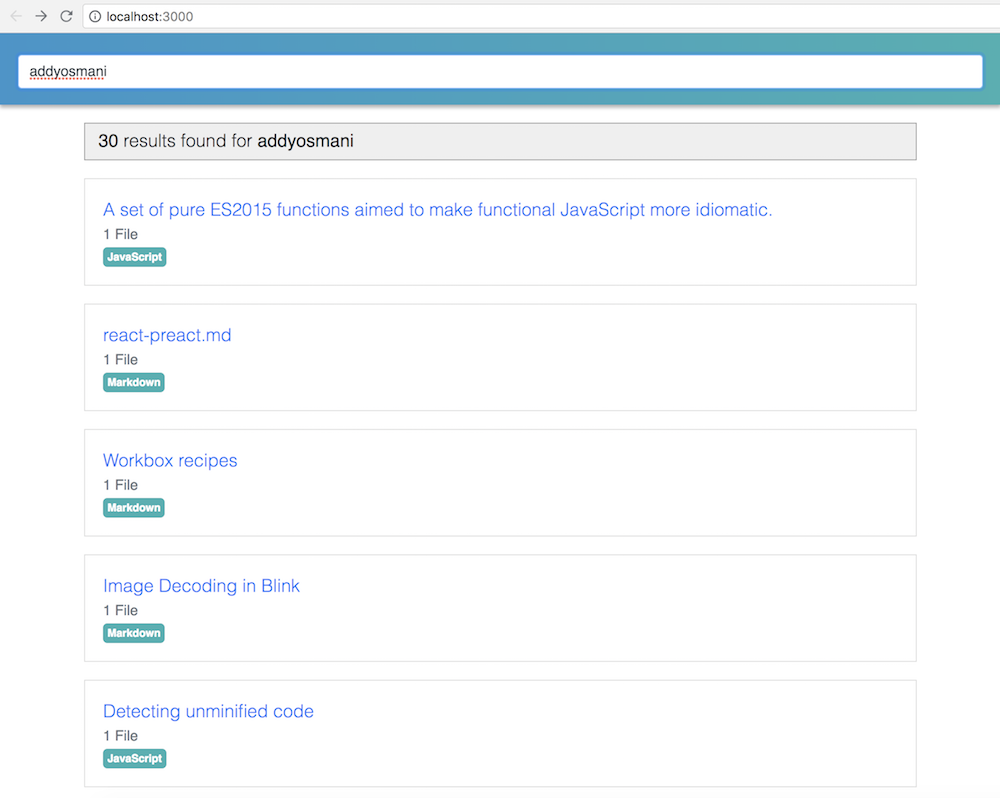
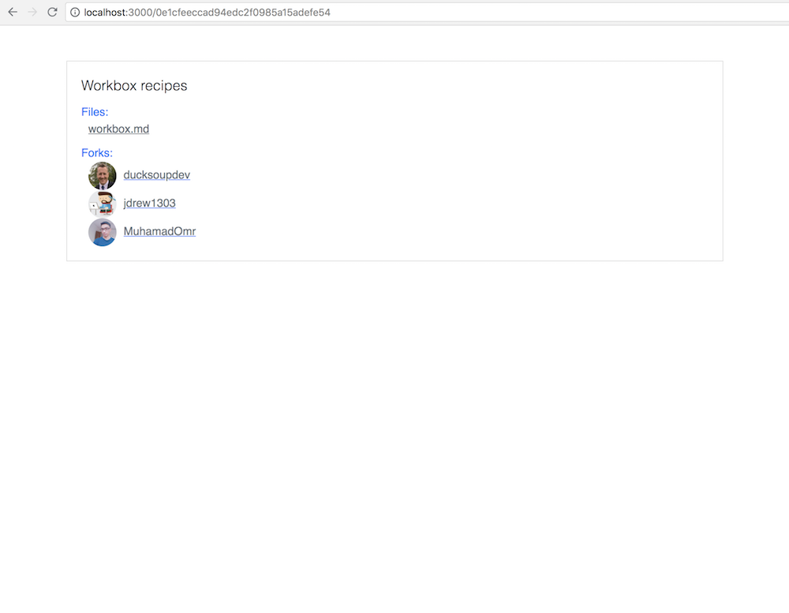
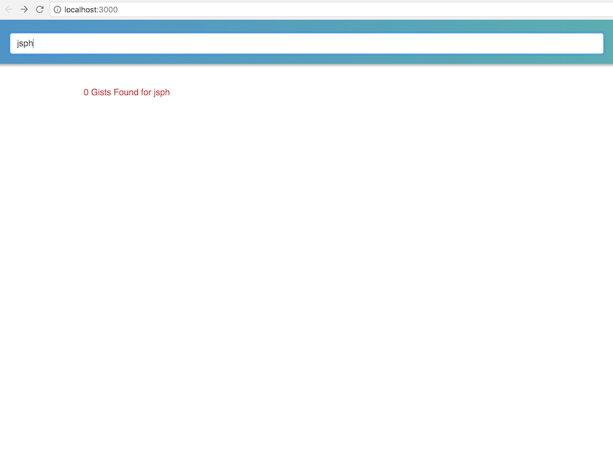

# Project Title
React Single Page Application demo that uses Github Gist API to show all public gists for an user.

## Description
ReactJS Single Page App demo which has the following features:
1. Search: When a user enters a username, it should be able to get a full list of public gists by that user.
2. Filetype: Convert the filetypes of the files in the gist into a tag/badge, (e.g, if the returned gist has list of files containing python and javascript files, the gist should have the respective tags/badges). 
3. Fork: Username/Avatar of the last 3 users who forked it with avatar linking to the fork. 


## Libraries/Components used
* create-react-app: Starter kit to create a reactjs app.
* bootstrap css (4.1.3): For styling and basic layout.
* react-router-dom (4.3.1): For routing between the search results screen and the detail screen.
* redux, react-redux: For data state management.
* redux-thunk: redux middleware library to dispatch asynchronous actions.
* For api calls I am using the fetch() method, which returns a Promise.

## Getting Started and Installing
These instructions will get you a copy of the project up and running on your local machine for development and testing purposes. See deployment for notes on how to deploy the project on a live system.

* First Git clone the repo into your computer
```
git clone https://github.com/jsphkhan/react-gist-demo.git
```
* Open your terminal
```
$ cd react-gist-demo
$ npm install
```
* This should install all the dependencies. Once done
* Run 
``` 
$ yarn start
or
$ npm start
```
* to start the server.
* open (http://localhost:3000) in your browser. 
* This should open up the Demo App


## Demo Screens
* All Gists for a user


* Gist Details with Forks


* Basic Error scenarios


#### Generating a Production build
```
$ cd react-gist-demo
$ npm run build
or
$ yarn build
```

## Live Demo (eg. Now)
I have deployed the demo application into Now(Zeit) server. 
* Live Demo URL: [https://react-gist-demo-iqebiotdhs.now.sh/](https://react-gist-demo-iqebiotdhs.now.sh/)

## Possible Improvements
* Pagination for large result set.[https://github.com/seatgeek/react-infinite](react-infinite) or [https://github.com/bvaughn/react-virtualized](react-virtualized).
* Better Styling may be.
* Use of normalizr library to normalize the redux store. [https://github.com/paularmstrong/normalizr](normalizr).
* Unit Tests - JEST & Enzyme.

## Authors
* **Joseph Khan** - (https://github.com/jsphkhan)

## License
This project is licensed under the MIT License
